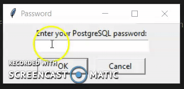
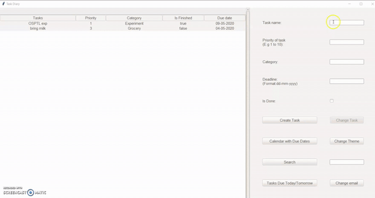

<p align="center">
  <a href="" rel="noopener">
 
</p>
<h1 align = 'center'> Task Diary</h1>

<br>

[](https://www.python.org "Python3")
[](https://www.postgresql.org/)

</p>

## Description ##

Task Diary is a desktop appl that enables user to keep all tasks in one application.User can filter the tasks and get notification of tasks.
<p>
For more details-
<a href="https://docs.google.com/document/d/13pVtgUSC7o03bKBDcg3bcGvAIQdTwMelTM2_UoI3obQ/edit?usp=sharing">
Document link 
</a>
</p>

------------------------------------------
## Features ##

- User Sign In and Sign Up
- Display tasks
- Can add task,update task,delete task 
- Sort the tasks according to it's category,task name,due date and priority
- Can browse the task 
- Get email,desktop notification
- Overview of due dates in the form of calendar

------------------------------------------
## Demo ##
Sign In


Task Diary

## How To Use
#### Software Requirements

PostgreSql<br>
Python3

#### Installation
Install the dependencies by running:
 <!-- pip install -r requirements.txt -->
```html  
    pip install tkcalender
    pip install ttkthemes
    pip install smtplib
```

#### Run using Command Prompt

```html
    python start.py
```
For getting email notification of task:
<p>
Allow less secure app access by clicking:<a href="
https://myaccount.google.com/lesssecureapps">Turn On</a>
</p>

---
###             Tech stack
`Backend` : Python3  <br>
`Database` : PostgreSQL <br>
`Frontend` : Tkinter(module of python)  <br>


------------------------------------------

<h3 align="center"><b>Developed with :heart: by <a href="https://github.com/hiral72">Hiral</a> and <a href="https://github.com/Sakshi107">Sakshi</a></b></h1>
